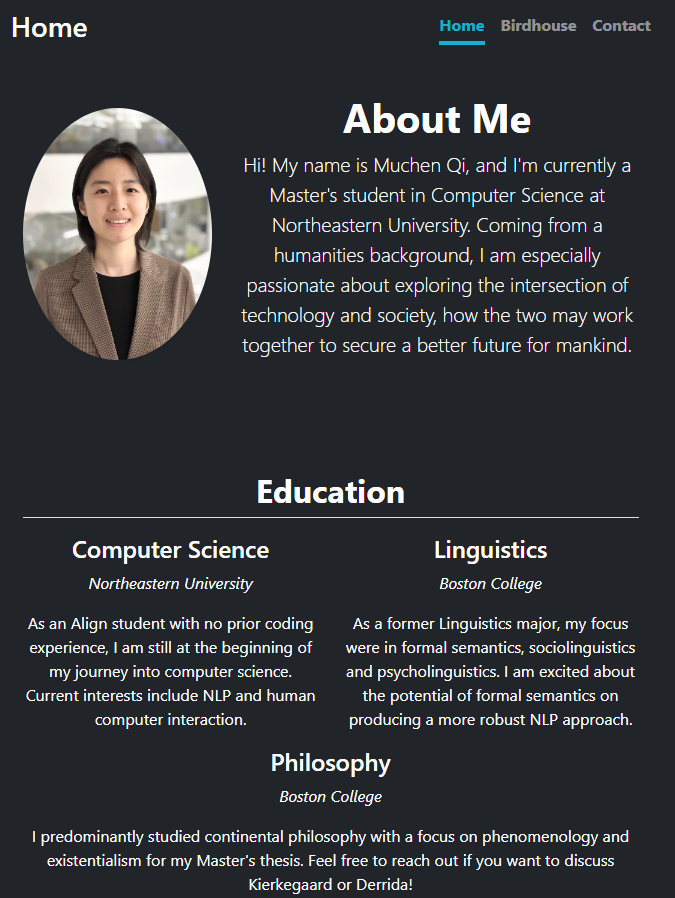
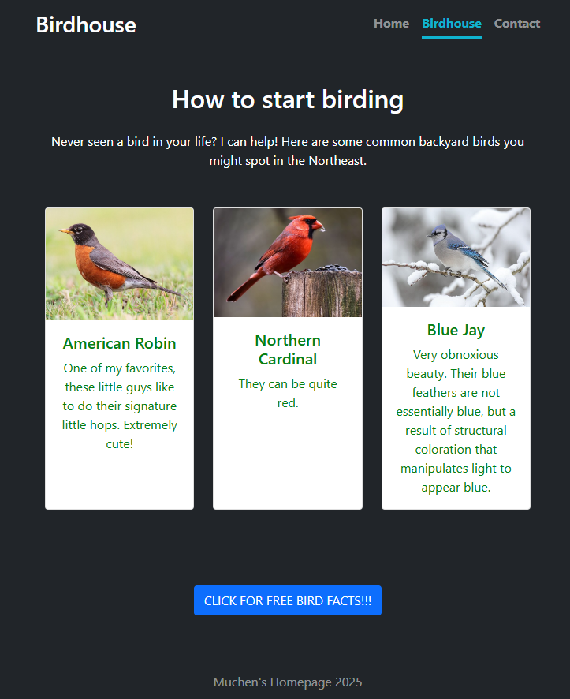
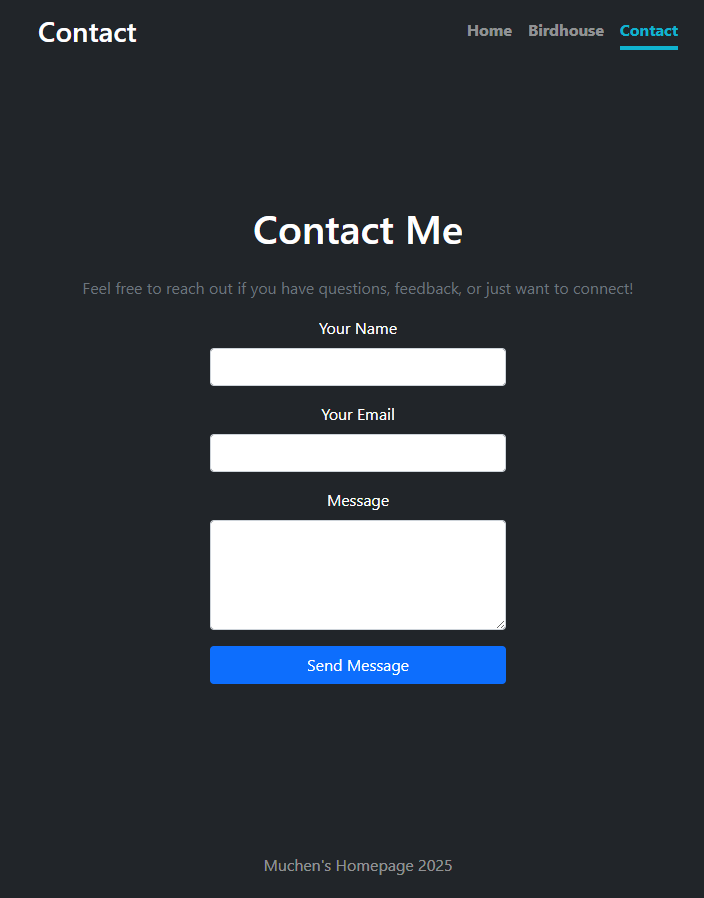

# My Homepage Project

## Author

Muchen Qi

## Class Link

https://johnguerra.co/classes/webDevelopment_online_fall_2025/

## Project Objective

This project is a simple HTML + CSS + JavaScript webpage designed to practice core web development skills.  
It is composed of three pages based on the Bootstrap Cover template, one of which designed by generative AI.

Core features:

- A Home page introducing the author to potential viewers.
- A Birdhouse page that showcases common backyard birds in the Noreastern US, made with Bootstrap cards.
- A Contact page designed and implemented by generative AI.
- A clean page design using the Bootstrap Cover template.
- An original JavaScript functionality, designed to present a random bird fact when prompted.

## Screenshot





## Instructions to Build

1. Clone this repository:

   ```bash
   git clone https://github.com/MuchenQi/my_homepage.git

   ```

2. Open the project folder:

   ```
    bash
    Copy code
    cd my_homepage

   ```

3. Open index.html in any browser to view the page.

No server setup is required — this project runs entirely on the client side.

## Use of generative AI

The third page of this project, namely the contact page, was designed by ChatGPT-5. The prompt was the rubric of the project + "please generate a contact page for my homepage". I then revised the format so it fits the general template of the other pages, but otherwise no other changes were made to the original code generated by AI.
